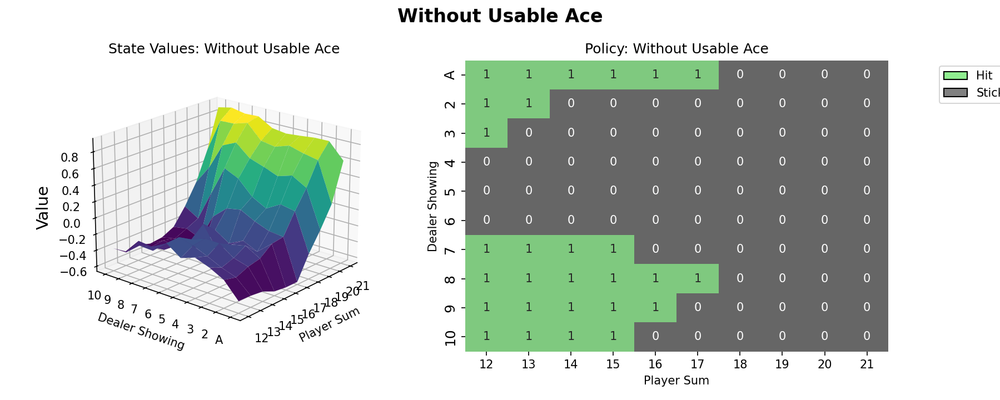
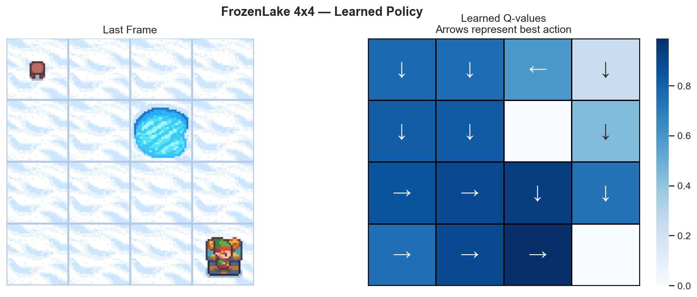
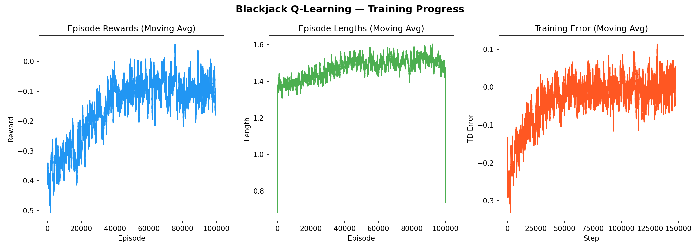
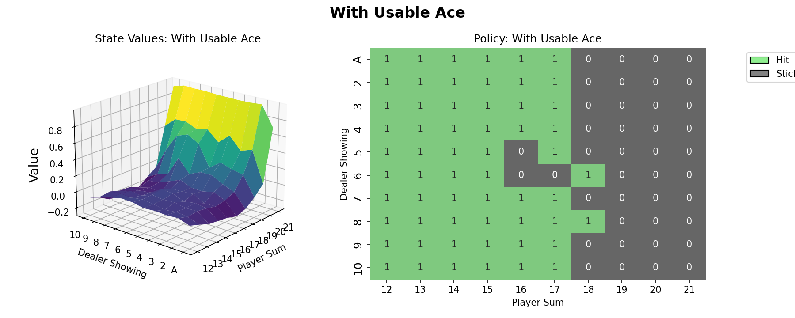
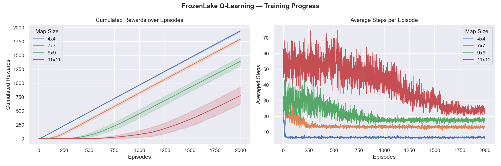
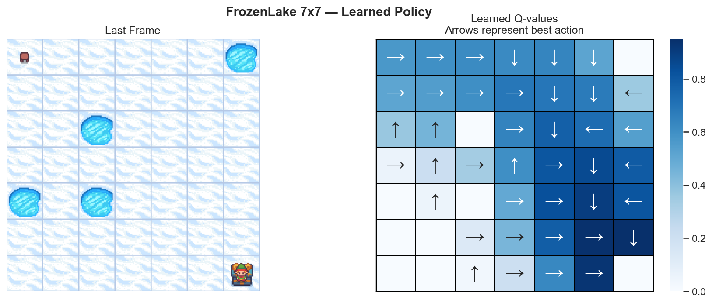
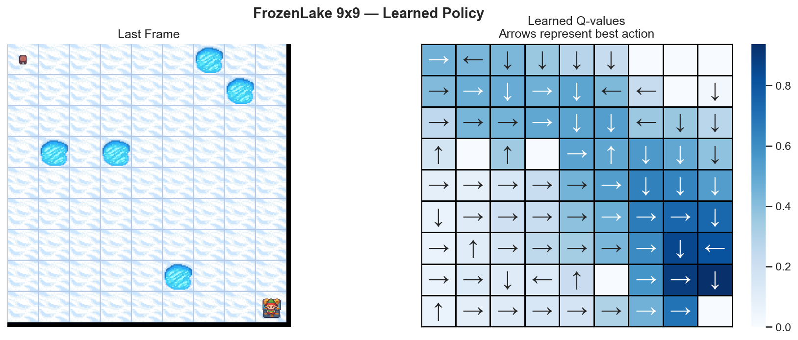
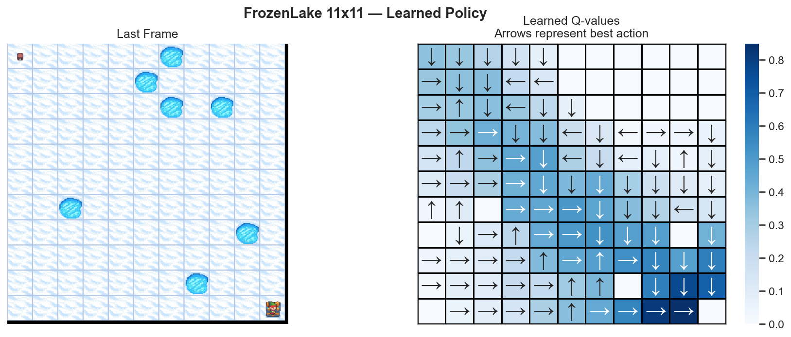

# Reinforcement Learning — Blackjack & FrozenLake

[](https://python.org)
[](https://gymnasium.farama.org)
[](https://opensource.org/licenses/MIT)

Train AI agents to play **Blackjack** and navigate **FrozenLake** using **Tabular Q-Learning** — a foundational Reinforcement Learning algorithm. Built with OpenAI's [Gymnasium](https://gymnasium.farama.org/) library.

<p align="center">
  
  
</p>

---

## Overview

This project implements two classic RL environments to demonstrate how a Q-Learning agent discovers optimal strategies through trial-and-error:

| Environment    | State Space                             | Action Space    | Goal                                        |
| -------------- | --------------------------------------- | --------------- | ------------------------------------------- |
| **Blackjack**  | `(player_sum, dealer_card, usable_ace)` | `Hit` / `Stick` | Beat the dealer without going over 21       |
| **FrozenLake** | Grid position (integer)                 | `←` `↓` `→` `↑` | Navigate from Start to Goal, avoiding Holes |

### Q-Learning Update Rule

```
Q(s, a) ← Q(s, a) + α · [R + γ · max Q(s', a') − Q(s, a)]
```

Where `α` = learning rate, `γ` = discount factor, `R` = immediate reward.

---

## Quick Start

### Prerequisites

- Python 3.10+
- pip

### Installation

```bash
# Clone the repository
git clone https://github.com/linanguyen05/ReinforcementLearning_Blackjack_FrozenLake.git
cd ReinforcementLearning_Blackjack_FrozenLake

# Install dependencies
pip install gymnasium numpy matplotlib seaborn tqdm pandas
```

### Run the Agents

```bash
# Train Blackjack agent
python code/blackjack_qlearning.py

# Train FrozenLake agent (runs on 4x4, 7x7, 9x9, 11x11 maps)
python code/frozenlake_qlearning.py
```

All output charts are saved to the `outputs/` directory automatically.

---

## Blackjack Agent

The agent learns when to **Hit** or **Stick** based on its current hand, the dealer's visible card, and whether it holds a usable Ace.

### Hyperparameters

| Parameter           | Value                                              |
| ------------------- | -------------------------------------------------- |
| Learning rate (α)   | `0.01`                                             |
| Discount factor (γ) | `0.95`                                             |
| Episodes            | `100,000`                                          |
| Epsilon             | `1.0 → 0.1` (linear decay over first 50k episodes) |

### Results

After training, the agent achieves a **~43–47% win rate** (excluding draws) — near-optimal for Blackjack, where the house always has a statistical edge.

<details>
<summary>Training Progress</summary>



</details>

<details>
<summary>Learned Policy — Without Usable Ace</summary>


</details>

<details>
<summary>Learned Policy — With Usable Ace</summary>



</details>

The learned policies closely match the theoretical **basic strategy** from Sutton & Barto's textbook.

---

## 🧊 FrozenLake Agent

The agent learns to navigate a grid of frozen tiles (`F`), holes (`H`), a start (`S`), and a goal (`G`) — finding the safest path to the goal.

### Hyperparameters

| Parameter           | Value           |
| ------------------- | --------------- |
| Learning rate (α)   | `0.8`           |
| Discount factor (γ) | `0.95`          |
| Epsilon             | `0.1` (fixed)   |
| Episodes per map    | `2,000`         |
| Runs per map        | `20` (averaged) |
| Slippery            | `False`         |

### Multi-Map Scaling Experiment

Trained across **4 map sizes** to study how Q-Learning scales with state space:

| Map   | States | Win Rate   | Convergence                  |
| ----- | ------ | ---------- | ---------------------------- |
| 4×4   | 16     | ✅ High     | Fast (~few hundred episodes) |
| 7×7   | 49     | ✅ Good     | Moderate                     |
| 9×9   | 81     | ⚠️ Moderate | Slow                         |
| 11×11 | 121    | ❌ 0%       | Insufficient episodes        |

> **Key insight:** Q-Learning requires exponentially more samples as state space grows. The 11×11 map needs 10k–20k episodes or epsilon decay to converge.

<details>
<summary>Training Progress (All Maps)</summary>



</details>

<details>
<summary>Learned Policies</summary>

|                    4×4                    |                    7×7                    |
| :---------------------------------------: | :---------------------------------------: |
|  |  |

|                    9×9                    |                     11×11                     |
| :---------------------------------------: | :-------------------------------------------: |
|  |  |

</details>

---

## Project Structure

```
.
├── code/
│   ├── blackjack_qlearning.py    # Blackjack agent (dict-based Q-table, epsilon decay)
│   └── frozenlake_qlearning.py   # FrozenLake agent (numpy Q-table, fixed epsilon)
├── outputs/                      # Generated charts and policy visualizations
│   ├── blackjack_*.png
│   └── frozenlake_*.png
└── README.md
```

---

## Tech Stack

- **[Gymnasium](https://gymnasium.farama.org/)** — RL environment framework (successor to OpenAI Gym)
- **[NumPy](https://numpy.org/)** — Q-table storage and numerical operations
- **[Matplotlib](https://matplotlib.org/) + [Seaborn](https://seaborn.pydata.org/)** — Visualization (policy heatmaps, training curves)
- **[pandas](https://pandas.pydata.org/)** — Results aggregation across runs
- **[tqdm](https://tqdm.github.io/)** — Progress bars

---

## References

- Sutton & Barto — *Reinforcement Learning: An Introduction* (2018)
- [Gymnasium Blackjack Tutorial](https://gymnasium.farama.org/tutorials/training_agents/blackjack_q_learning/)
- [Gymnasium FrozenLake Docs](https://gymnasium.farama.org/environments/toy_text/frozen_lake/)

